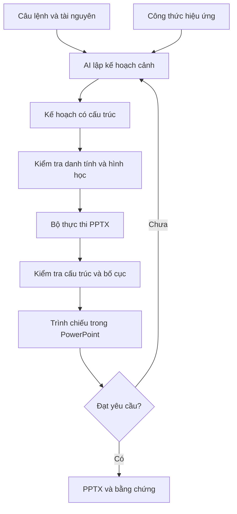

# Kiến trúc đề xuất

## Trách nhiệm từng phần

Skill chọn quy trình, phân rã ý đồ và đọc công thức cần dùng. Kế hoạch mô tả trạng thái và điều kiện chuyển tiếp. Bộ thực thi dựng đối tượng và gán hiệu ứng. Bộ kiểm tra phát hiện lỗi có thể xác định tự động. PowerPoint và người xem kiểm chứng chuyển động thực tế.

Định danh ngữ nghĩa như `sample-window` tồn tại xuyên cảnh. `!!sample-window` là tên ghép Morph theo quy ước được nghiên cứu. Numeric shape ID chỉ có ý nghĩa trong slide, không dùng làm danh tính toàn cục.

`duration_ms` trong hợp đồng là thời lượng chuyển tiếp mong muốn. Nó không cam kết mọi backend hỗ trợ đường cong easing riêng. Nghiên cứu easing phải ghi rõ backend hỗ trợ gì và đâu là gần đúng bằng trạng thái trung gian.

## Bộ thực thi cần đánh giá

| Lựa chọn | Vai trò dự kiến | Điều cần chứng minh |
|---|---|---|
| PowerPoint desktop + tự động hóa | Tạo, đọc timeline, trình chiếu và xuất video | Máy có PowerPoint, phiên bản, API khả dụng, thao tác không bị dialog chặn |
| Thư viện tạo PPTX + bước chỉnh OOXML | Tạo bố cục đa nền tảng, bổ sung chuyển tiếp | Mẫu chuẩn, quan hệ, namespace, mở lại PowerPoint và không mất hiệu ứng |
| Video nhúng | Các hiệu ứng cần render ngoài | Đồng bộ, codec, dung lượng; nội dung video không chỉnh từng đối tượng được |

Chưa chọn nhà cung cấp hoặc thư viện làm mặc định. PptxGenJS có thể là ứng viên tạo bố cục; không coi có API tạo PPTX đồng nghĩa có API animation.

## Chất lượng sáng tạo

Mỗi công thức phải nêu mục đích: bộc lộ quy mô, giữ đường theo dõi, tiết lộ quan hệ, hướng sự chú ý hoặc dẫn vào chi tiết. Mức độ độc đáo được đánh giá ở cách phối hợp và thích ứng với nội dung. Không có cam kết tự động đạt chất lượng nghệ thuật với mọi câu lệnh.

